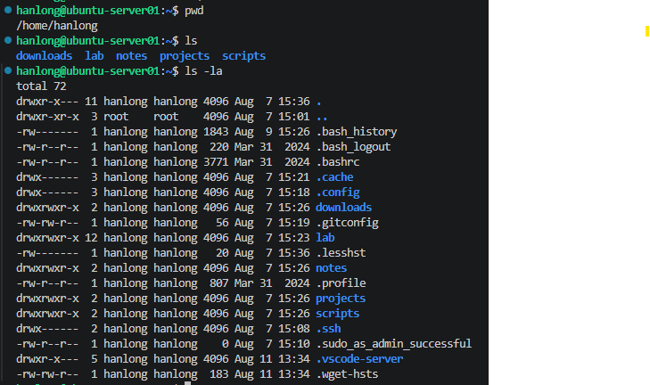
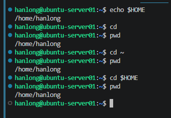
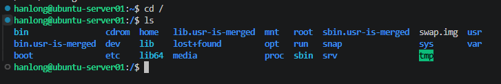
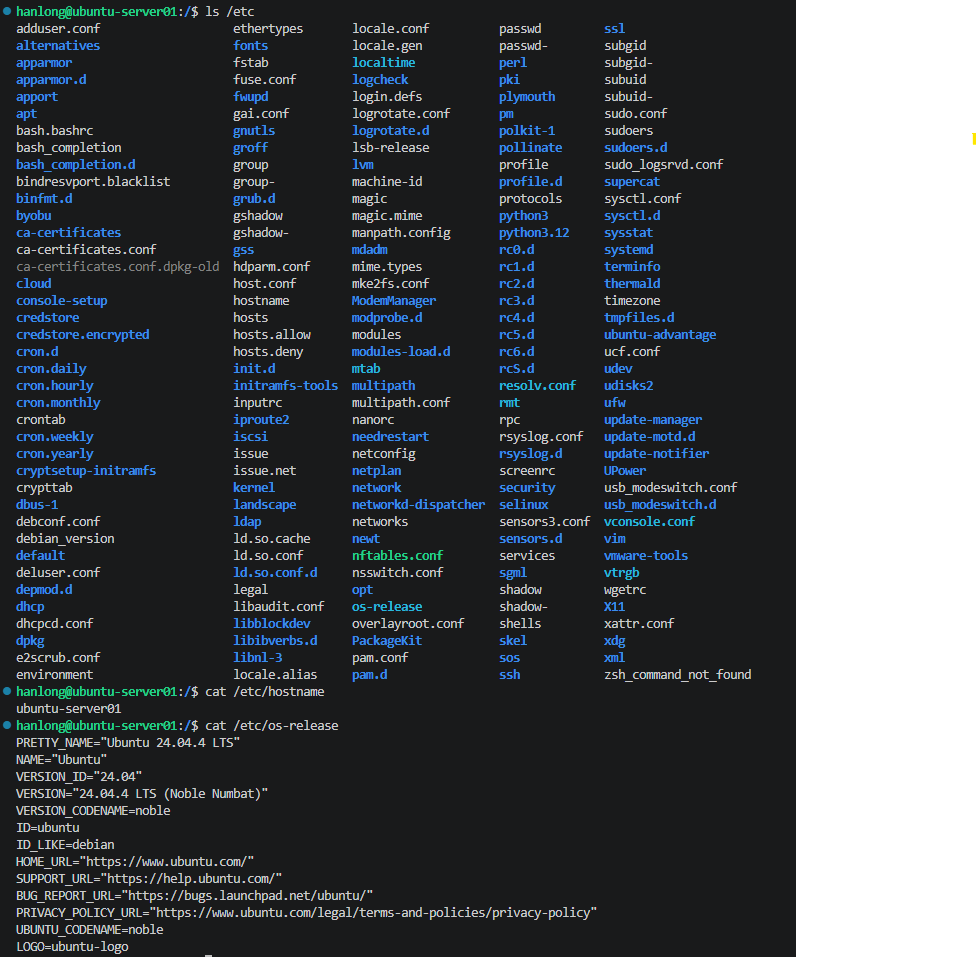
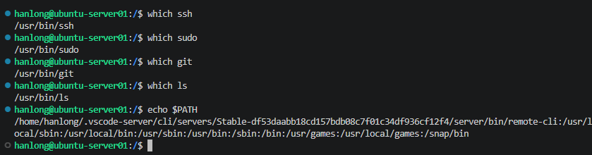
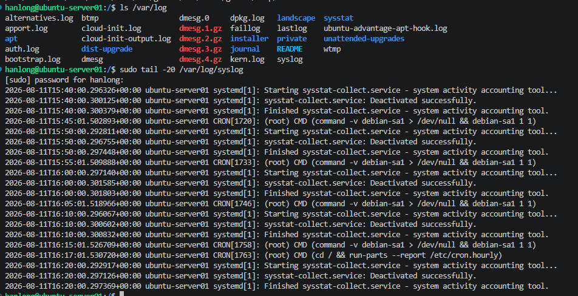
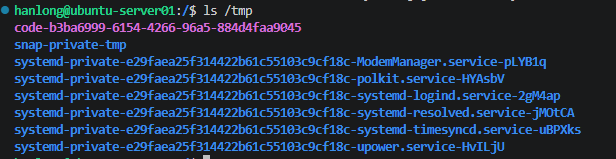
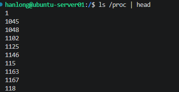
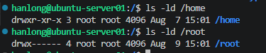

# Lab 01 - Linux Filesystem

## Objective

Explore the Linux filesystem hierarchy on `ubuntu-server01` and identify where Linux stores user data, configuration files, logs, temporary files, executables, and boot files.

## Environment

| Component | Details |
|---|---|
| Hostname | `ubuntu-server01` |
| Operating System | Ubuntu Server 24.04.4 LTS |
| User | `hanlong` |
| Remote Access | SSH |
| Server IP | `10.10.10.11` |

---

## 1. Current Working Directory

Checked my current location:

```bash
pwd
```

My home directory is:

```text
/home/hanlong
```

Listed normal files:

```bash
ls
```

Listed all files, including hidden files:

```bash
ls -la
```

### Observation

Files beginning with `.` are hidden by default.

Examples found in my home directory included:

```text
.bashrc
.profile
.ssh
```

I also observed:

- `.` represents the current directory.
- `..` represents the parent directory.

### Screenshot

<details>
<summary>Current working directory</summary>



</details>

---

## 2. Home Directory

Checked the value of my home directory:

```bash
echo $HOME
```

I also tested:

```bash
cd
cd ~
cd $HOME
```

All three methods returned me to:

```text
/home/hanlong
```

### Observation

Normal users typically have their home directories under `/home`.

The root account is different and uses:

```text
/root
```

### Screenshot

<details>
<summary>Home directory</summary>



</details>

---

## 3. Root Filesystem

Moved to the root of the filesystem:

```bash
cd /
```

Listed its contents:

```bash
ls
```

Major directories observed included:

| Directory | Purpose |
|---|---|
| `/home` | Home directories for normal users |
| `/root` | Root user's home directory |
| `/etc` | System configuration |
| `/var` | Variable data such as logs |
| `/tmp` | Temporary files |
| `/usr` | Programs, libraries and shared system data |
| `/boot` | Files required during boot |
| `/dev` | Device files |
| `/proc` | Runtime process and kernel information |
| `/sys` | Kernel and device information |
| `/opt` | Optional/additional software |


### Screenshot

<details>
<summary>Root filesystem</summary>



</details>

---

## 4. Configuration Files

Explored `/etc`:

```bash
ls /etc
```

Checked several important configuration files:

```bash
ls /etc/passwd
ls /etc/group
ls /etc/hostname
ls /etc/hosts
ls /etc/fstab
```

Checked the system hostname:

```bash
cat /etc/hostname
```

Result:

```text
ubuntu-server01
```

Checked the operating system information:

```bash
cat /etc/os-release
```

The server is running Ubuntu Server 24.04.4 LTS.

### Observation

`/etc` contains system-wide configuration files.

### Screenshot

<details>
<summary>Configuration files</summary>



</details>

---

## 5. Executable Programs

Located several commands:

```bash
which ssh
which sudo
which git
which ls
```

Examples:

```text
/usr/bin/ssh
/usr/bin/sudo
/usr/bin/git
```

### Observation

Many executable commands are stored under `/usr/bin`.

The shell searches directories listed in the `PATH` environment variable when locating commands.

```bash
echo $PATH
```

### Screenshot

<details>
<summary>Executable programs</summary>



</details>

---

## 6. System Logs

Explored the system log directory:

```bash
ls /var/log
```

Viewed recent system log entries:

```bash
sudo tail -20 /var/log/syslog
```

### Observation

`/var/log` contains logs generated by the operating system and services.

Logs are useful when investigating system and service problems.

### Screenshot

<details>
<summary>System logs</summary>



</details>

---

## 7. Temporary Files

Explored:

```bash
ls /tmp
```

### Observation

`/tmp` provides temporary storage for applications and users.

Files stored here should not be treated as permanent data.

### Screenshot

<details>
<summary>Temporary files</summary>



</details>

---

## 8. `/proc` and `/sys`

Explored `/proc`:

```bash
ls /proc | head
```

Many numeric directories were visible.

### Observation

The numbers correspond to running process IDs (PIDs).

`/proc` is a virtual filesystem that exposes runtime process and kernel information rather than behaving like normal persistent disk storage.

Explored `/sys`:

```bash
ls /sys
```

### Observation

`/sys` is another virtual filesystem that exposes information about the kernel, devices and hardware.

### Screenshot

<details>
<summary>/proc filesystem</summary>



</details>

<details>
<summary>/sys filesystem</summary>


</details>

---

## 9. Directory Permissions

Compared `/home` and `/root`:

```bash
ls -ld /home
ls -ld /root
```

`/home` showed:

```text
drwxr-xr-x
```

`/root` had more restrictive permissions.

Attempting to access `/root` as my normal user demonstrated that the root user's home directory is protected from normal users.

Using:

```bash
sudo ls /root
```

allowed privileged access.

### Screenshot

<details>
<summary>Directory permissions</summary>



</details>

---
## Result

Successfully explored the filesystem hierarchy of `ubuntu-server01` and identified the purpose of the major Linux filesystem locations.